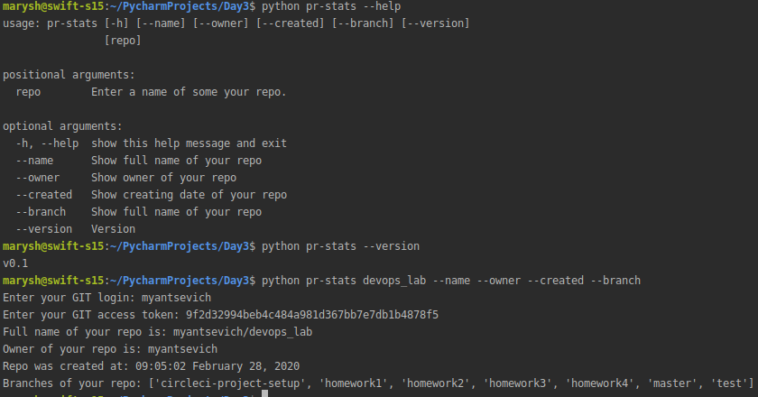

Summary
=======
Here is a script, which work with GIThub via API

How to work with
=======
## Example

  

**IMPORTANT: This app use your github login  and access token (instead of password). To create your personal token please, make the following simple actions: https://help.github.com/en/github/authenticating-to-github/creating-a-personal-access-token-for-the-command-line

